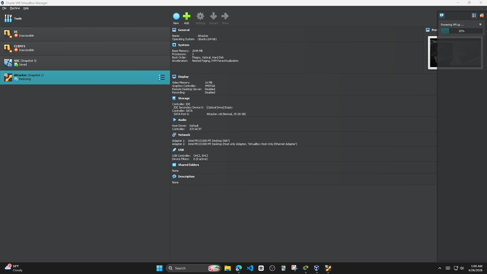
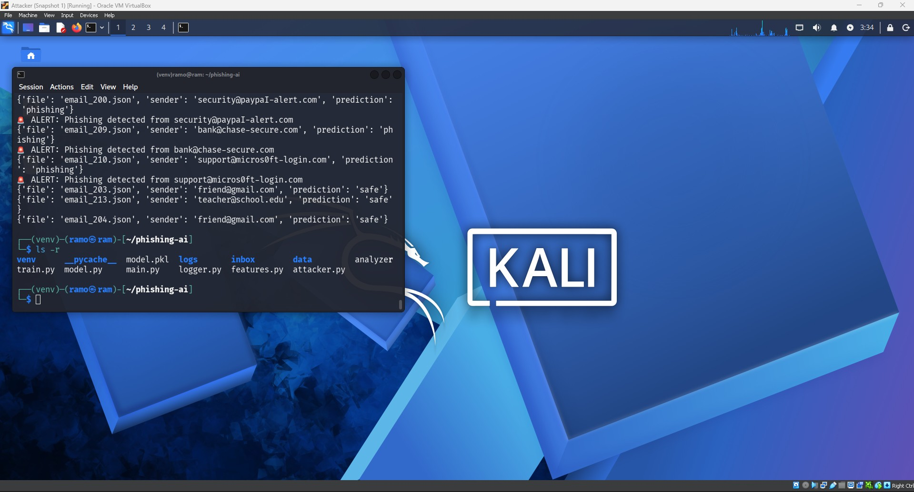
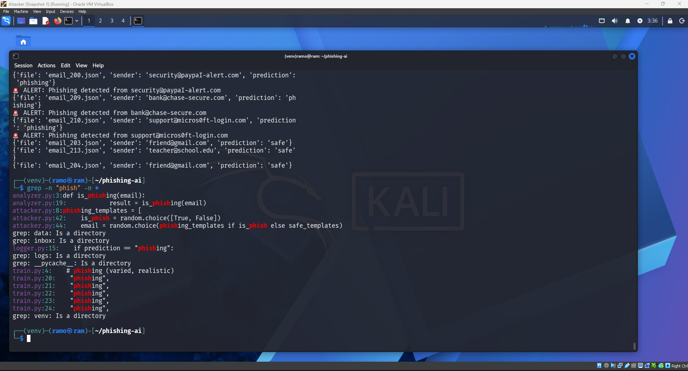
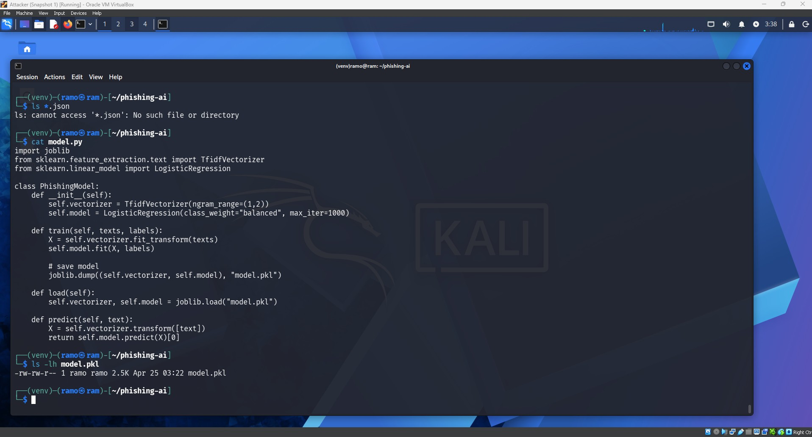
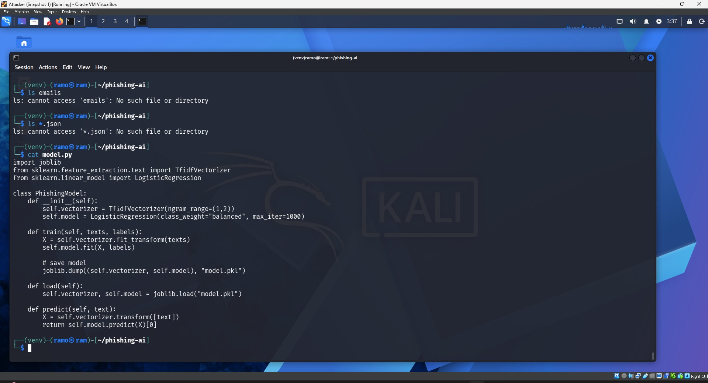
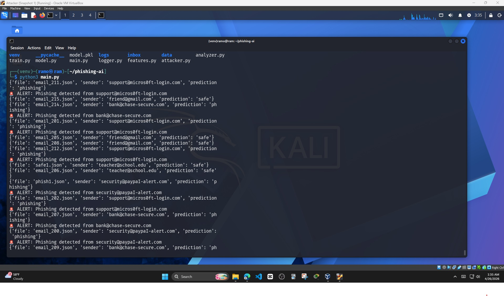
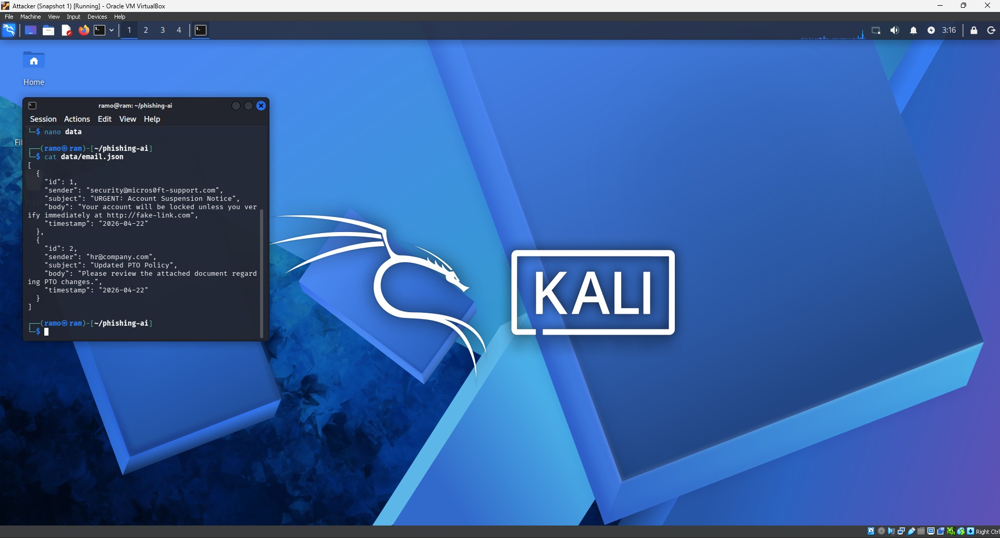

# AI Phishing Detection Lab

## Objective  
In this solo project, I built a phishing detection system using Python and machine learning to classify emails as either phishing or safe. The goal was to simulate how a SOC analyst would triage suspicious emails by automating detection, generating realistic attack data, and logging alerts for investigation.

---

## What I Did  

**VirtualBox Lab Environment**  
I ran the project inside a Kali Linux virtual machine using Oracle VirtualBox.

**Screenshot 1:** Click on the image to zoom in and view the details more clearly.  

---

**Project Folder Structure**  
I organized the project into separate files for training, detection, feature extraction, logging, and simulated email generation.

**Screenshot 2:** Click on the image to zoom in and view the details more clearly.  

---

**Searching Through Detection Logic**  
I used grep to inspect where phishing logic appeared across the project files.

**Screenshot 3:** Click on the image to zoom in and view the details more clearly.  

---

**Viewing the Model File**  
I confirmed that the trained model file was saved as `model.pkl`.

**Screenshot 4:** Click on the image to zoom in and view the details more clearly.  

---

**Reviewing the Machine Learning Code**  
I reviewed the `model.py` file, which uses TF-IDF vectorization and Logistic Regression to classify email text.

**Screenshot 5:** Click on the image to zoom in and view the details more clearly.  

---

**Running the Detection System**  
I ran `main.py` to analyze generated emails and display phishing alerts.

**Screenshot 6:** Click on the image to zoom in and view the details more clearly.  

---

**Working with Email JSON Data**  
I created structured JSON email data to simulate phishing and safe emails.

**Screenshot 7:** Click on the image to zoom in and view the details more clearly.  

---

## Skills Gained  
- Built a machine learning phishing detection model
- Used TF-IDF vectorization and Logistic Regression
- Simulated phishing and safe emails with JSON data
- Created an automated email analysis pipeline
- Logged phishing alerts for investigation
- Practiced cybersecurity detection workflows in a Kali Linux VM

## Tools Used  
- Python
- Scikit-learn
- Kali Linux
- Oracle VirtualBox
- JSON
- GitHub
